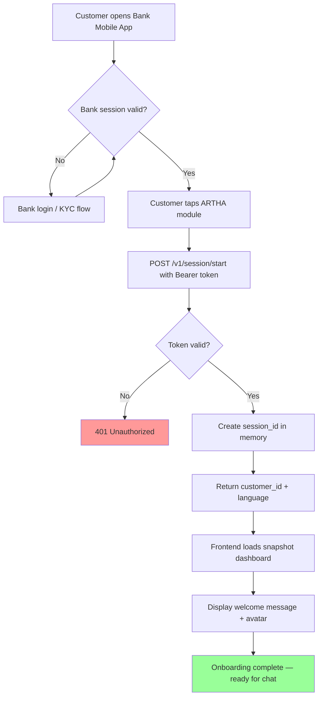
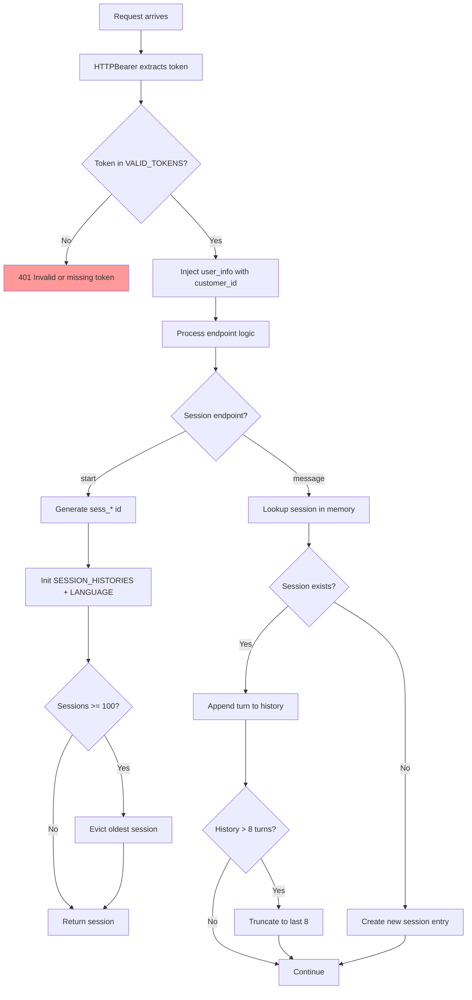
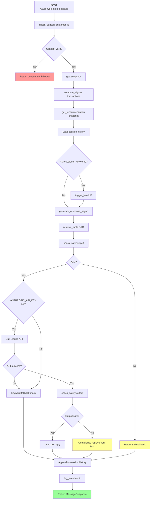
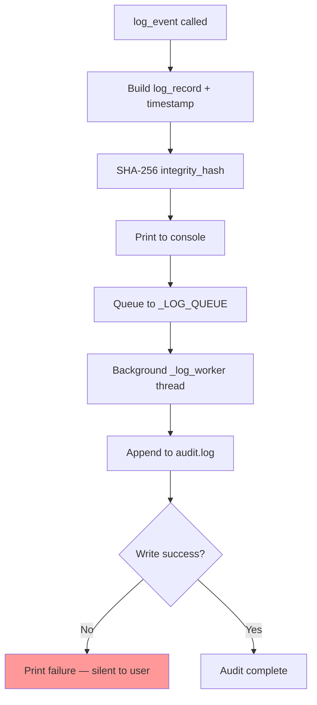
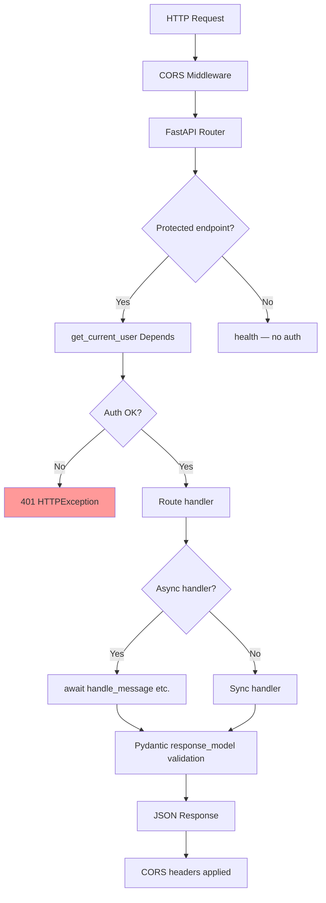
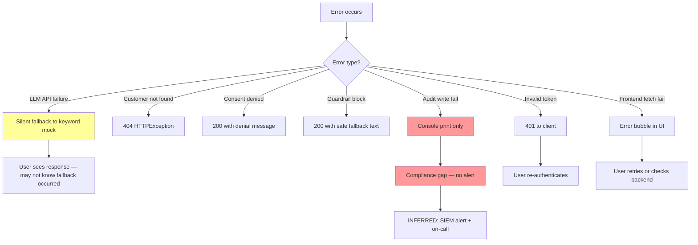
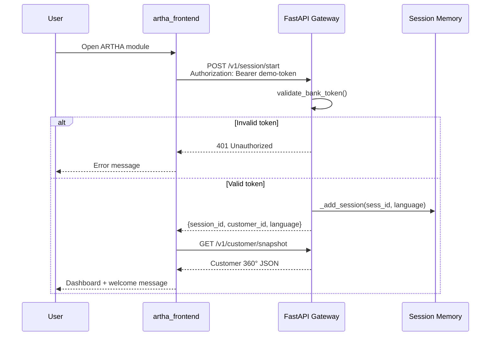
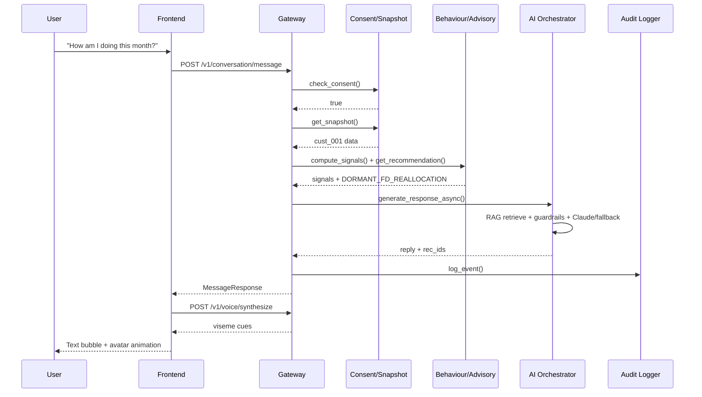
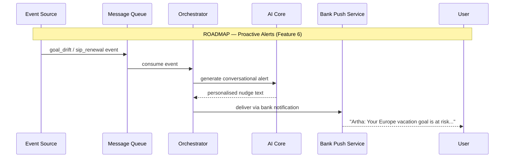
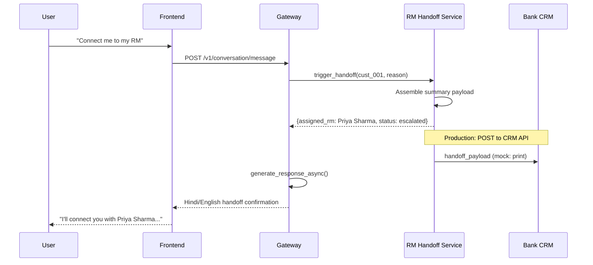

# 06 — Process Flow Diagrams

**Document ID:** ARTHA-DOC-06  
**Phase:** 2.3–2.4 — Process Flows and Sequence Diagrams

---

## 1. User Registration and Onboarding

`[INFERRED: ARTHA reuses bank KYC — no separate registration in MVP]`

---

## 2. Authentication and Session Lifecycle

---

## 3. Core Transaction Flow (Conversation Message)

---

## 4. Background Job and Queue Processing

`[OBSERVED: audit_logger.py uses threading.Queue — only async job in system]`

---

## 5. API Request Lifecycle

---

## 6. Error Handling and Incident Response

---

## Sequence Diagrams

### User Login (Session Start)

### Primary Business Transaction (Chat Message)

### Notification / Webhook Handling

`[INFERRED STRATEGY: not implemented — future proactive alerts]`

### Admin Approval Workflow (RM Handoff)

---

## Lens Summary

| Lens | Diagram Insight |
| ---- | --------------- |
| **Autopsy** | Core flow has 8 orchestration steps before response |
| **Ghost Mode** | LLM fallback not shown in user-facing flow |
| **Red Team** | Consent denial is only gate — snapshot GET has no consent re-check |
