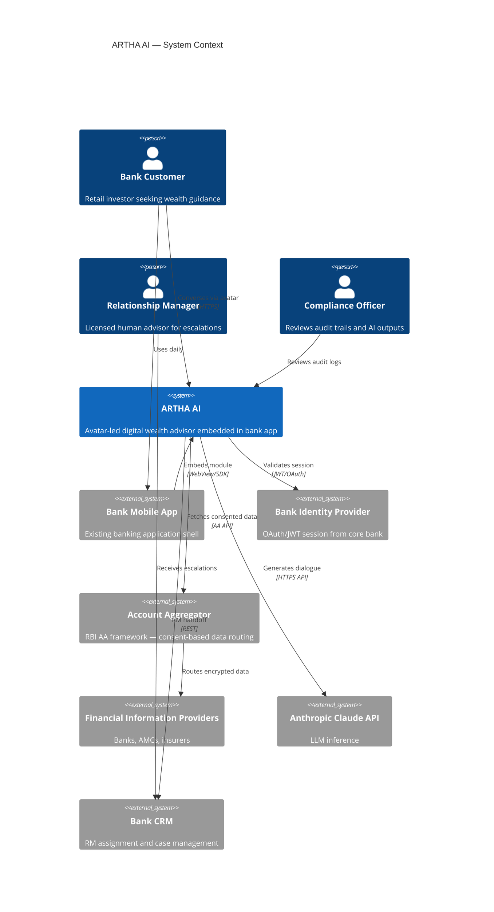
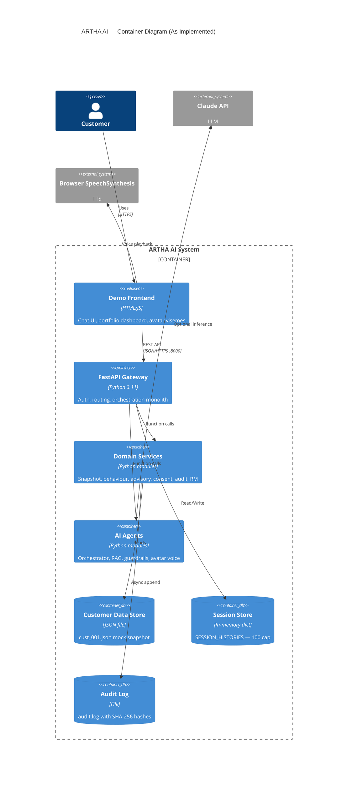
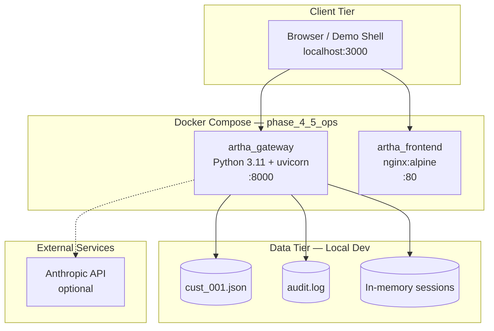

# 07 — C4 Architecture Documentation

**Document ID:** ARTHA-DOC-07  
**Phase:** 3 — Architecture Design Document

---

## 3.1 C4 System Context Diagram

`[OBSERVED: bankAuth = demo-token; AA/CRM = mock in MVP]`

---

## 3.2 C4 Container Diagram

`[INFERRED STRATEGY: target state adds Redis, PostgreSQL, separate microservice containers per blueprint]`

---

## 3.3 C4 Component Diagram

| Component | Responsibility | Interfaces | Dependencies | Notes |
| --------- | -------------- | ---------- | ------------ | ----- |
| `main.py` | HTTP routing, auth, orchestration entry | FastAPI routes | All services + agents | Monolith gateway |
| `customer_snapshot` | Load 360° profile | `get_snapshot(id)` | JSON file I/O | Legacy mock for id=123 |
| `behaviour_engine` | Transaction analytics | `compute_signals(txs)` | datetime | Savings rate, dining delta |
| `advisory_engine` | Rules-based recommendations | `get_recommendation(snapshot)` | datetime | DORMANT_FD, EMERGENCY_FUND rules |
| `consent_service` | AA consent validation | `check_consent(user_id)` | snapshot | Scope + expiry check |
| `ai_orchestrator` | LLM dialogue generation | `generate_response_async(...)` | RAG, guardrails, Anthropic | Dual-mode fallback |
| `rag_knowledge_base` | Product fact retrieval | `retrieve_facts(query)` | Static PRODUCT_KNOWLEDGE | Keyword match, not vector |
| `compliance_guardrails` | Input/output safety | `check_safety(text)` | regex | Injection + compliance patterns |
| `avatar_voice` | Viseme timing | `synthesize_voice_details(text, lang)` | — | Mock audio URL |
| `audit_logger` | Compliance trail | `log_event(data)` | threading, hashlib | Background writer |
| `rm_handoff` | Human escalation | `trigger_handoff(id, reason)` | snapshot, behaviour | CRM mock |

---

## 3.4 Deployment Diagram

### Environments

| Environment | Status | Topology |
| ----------- | ------ | -------- |
| Local dev | `[OBSERVED]` | uvicorn + serve/npx |
| Docker | `[OBSERVED]` | docker-compose.yml |
| Staging | `[MISSING]` | — |
| Production | `[MISSING]` | — |

---

## 3.5 Technology Stack Rationale

| Layer | Current Technology | Version | Rationale | Alternatives | Trade-offs |
| ----- | ------------------ | ------- | --------- | ------------ | ---------- |
| Frontend | HTML/CSS/JS demo | — | Fastest hackathon path | React Native SDK | Not embeddable in bank app yet |
| Backend | FastAPI | 0.111.0 | Async, Pydantic, OpenAPI auto | NestJS, Express | Python aligns with AI libs |
| Runtime | Python + uvicorn | 3.11 / 0.30.1 | Team familiarity | Node.js | — |
| LLM | Claude 3.5 Sonnet | API | Quality + safety | GPT-4, Gemini | Vendor lock-in |
| RAG | Keyword match | Custom | Demo speed | pgvector, Pinecone | Lower retrieval quality |
| Data | JSON file | — | Zero setup | PostgreSQL | No query/index |
| Session | Python dict | — | Simplicity | Redis | Lost on restart |
| Auth | HTTPBearer + static token | — | Demo only | OAuth2/OIDC + JWT | Not production-safe |
| Voice | Browser SpeechSynthesis | Web API | No API cost | Azure/Google TTS | Quality varies |
| CI | GitHub Actions | — | Standard | GitLab CI | Tests path broken |
| Container | Docker Compose | — | Local parity | Kubernetes | No HA yet |
| Testing | unittest | stdlib | No extra deps | pytest | CI expects pytest |

---

## 3.6 Multi-Cloud Service Mapping

| Capability | AWS | Azure | GCP | Selection Criteria |
| ---------- | --- | ----- | --- | ------------------ |
| API hosting | ECS/EKS | AKS | GKE | Bank cloud mandate |
| PostgreSQL | RDS | Azure Database | Cloud SQL | Managed HA |
| Redis | ElastiCache | Azure Cache | Memorystore | Session store |
| Vector DB | OpenSearch | Cognitive Search | Vertex Matching | RAG at scale |
| LLM | Bedrock (Claude) | Azure OpenAI | Vertex AI | Data residency |
| Secrets | Secrets Manager | Key Vault | Secret Manager | API key rotation |
| Audit logs | CloudWatch + S3 | Monitor + Blob | Cloud Logging | Immutable retention |
| TTS | Polly | Neural TTS | Cloud TTS | Indian language voices |

`[INFERRED STRATEGY BASED ON MARKET STANDARD: Indian banks often prefer Azure or on-prem]`

---

## 3.8 Architecture Decision Records (Summaries)

### ADR-001: Rules Before LLM for Recommendations

| Field | Content |
| ----- | ------- |
| **Context** | Financial advice requires traceable reasoning; LLMs hallucinate |
| **Decision** | Advisory engine computes recommendations deterministically; LLM only narrates |
| **Alternatives** | End-to-end LLM recommendations; external robo API |
| **Consequences** | Slower rule expansion; high compliance credibility |
| **Risks** | Rules may be incomplete for edge cases |
| **Rollback** | Add LLM-suggested rules with human approval queue |

### ADR-002: FastAPI Monolith for MVP

| Field | Content |
| ----- | ------- |
| **Context** | Hackathon timeline; blueprint describes microservices |
| **Decision** | Single FastAPI app with module separation |
| **Alternatives** | Full microservice decomposition day one |
| **Consequences** | Fast delivery; refactor needed for scale |
| **Risks** | Tight coupling as team grows |
| **Rollback** | Extract services behind same API contracts |

### ADR-003: Dual-Mode LLM (API + Keyword Fallback)

| Field | Content |
| ----- | ------- |
| **Context** | Demo must work without API key; venue Wi-Fi unreliable |
| **Decision** | Anthropic when key present; regex keyword mock otherwise |
| **Alternatives** | Require API key; local model (Ollama) |
| **Consequences** | Reliable demos; silent quality degradation |
| **Risks** | `[RISK: Ghost Mode — user unaware of fallback]` |
| **Rollback** | Surface "offline mode" indicator in UI |

### ADR-004: In-Memory Session with 8-Turn Cap

| Field | Content |
| ----- | ------- |
| **Context** | LLM token cost and latency |
| **Decision** | Dict-based sessions; cap history at 8 turns |
| **Alternatives** | Redis; unlimited history with summarization |
| **Consequences** | Simple; lost on restart |
| **Risks** | Poor UX after server restart mid-conversation |
| **Rollback** | Redis with TTL |

### ADR-005: Keyword RAG over Vector Search

| Field | Content |
| ----- | ------- |
| **Context** | Small product KB (~5 facts); pgvector in requirements unused |
| **Decision** | Keyword matching in `rag_knowledge_base.py` |
| **Alternatives** | pgvector on Postgres; Pinecone |
| **Consequences** | Fast; misses semantic matches |
| **Risks** | Poor retrieval for paraphrased queries |
| **Rollback** | Embed PRODUCT_KNOWLEDGE into pgvector |

---

## 3.9 Failure Mode and Resilience Notes

| Component | SPOF | Degraded Mode | Retry | Circuit Breaker | Timeout | Backup | Chaos Test |
| --------- | ---- | ------------- | ----- | --------------- | ------- | ------ | ---------- |
| FastAPI process | Yes | Total outage | — | None | None | Restart container | Kill pod |
| In-memory session | Yes | New session on restart | — | — | — | None | Restart mid-chat |
| JSON data file | Yes | 404 if missing | — | — | — | File backup | Delete file |
| Anthropic API | No | Keyword fallback | None | None | SDK default | Fallback | Revoke API key |
| Audit logger | Partial | Console only if disk full | Queue retry | — | — | Log shipping | Fill disk |
| nginx frontend | Yes | Static files only | — | — | — | Second instance | Stop nginx |

---

## 3.10 Disaster Recovery

| Metric | Target (Inferred) | Current State |
| ------ | ----------------- | ------------- |
| **RPO** | 1 hour | `[MISSING: no backup automation]` |
| **RTO** | 4 hours | `[MISSING: manual restart only]` |
| Failover | Active-passive API instances | Single instance |
| Restore testing | Quarterly | Not scheduled |
| Backup retention | 7 years (financial audit) | Local audit.log only |

---

## Lens Summary

| Lens | Finding |
| ---- | ------- |
| **Critic Kill** | Document as monolith; blueprint microservices are target state |
| **IQ200** | ADR-001 (rules before LLM) is the architectural invariant |
| **10x** | Deployment diagram needs Redis + Postgres + K8s for scale |
