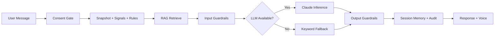
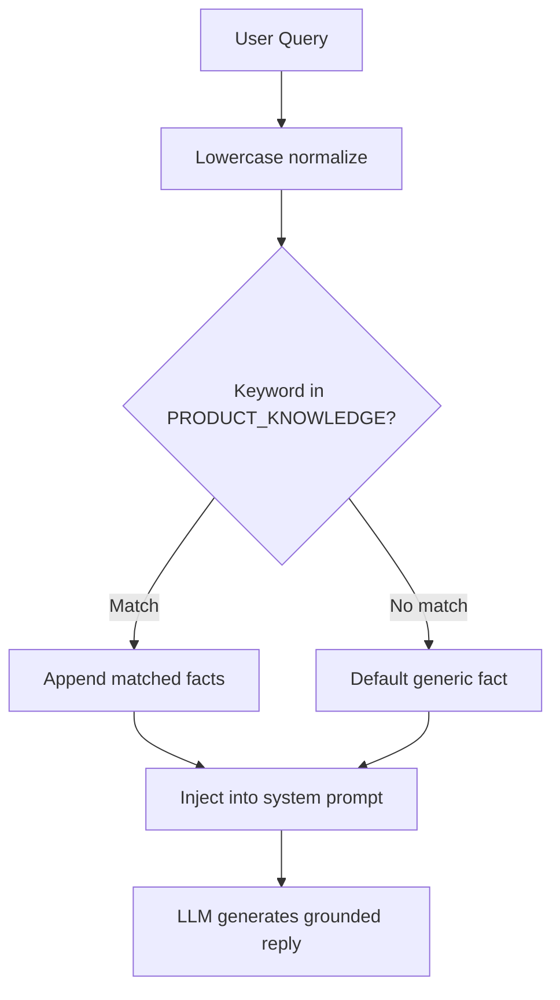
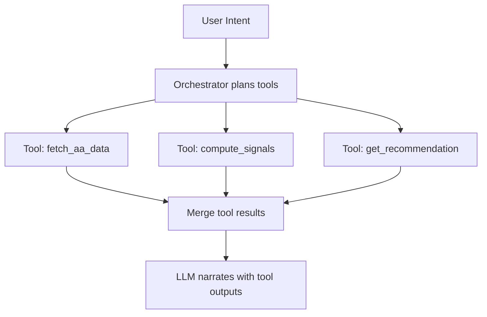
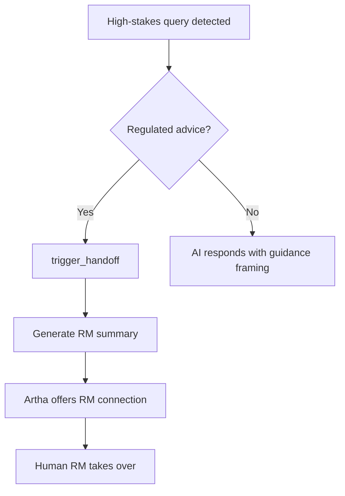

# 12 — AI / LLM / Agentic Architecture

**Document ID:** ARTHA-DOC-12  
**Phase:** 11 — AI / LLM / Agentic System Architecture  
**Audit Lenses:** IQ200, Red Team, Blue Team, 10x, Ghost Mode

`[OBSERVED: AI subsystem exists — not optional extension]`

---

## 11.1 AI Capability Inventory

| AI Capability ID | Capability | Business Purpose | Trigger | Input | Output | Model | Human Review | Risk | NIST RMF Mapping |
| ---------------- | ---------- | ---------------- | ------- | ----- | ------ | ----- | ------------ | ---- | ---------------- |
| AI-001 | Conversational dialogue | Natural wealth check-ins | User message | text + context | reply_text | Claude 3.5 Sonnet / fallback | Optional RM | Hallucination | MAP 2.1 |
| AI-002 | Product knowledge RAG | Ground facts in approved KB | Query keywords | user_text | fact strings | Keyword matcher | No | Incomplete retrieval | MAP 1.5 |
| AI-003 | Behavioural signals | Spending/savings analytics | Every message | transactions[] | signals dict | Deterministic Python | No | Stale data | MAP 1.1 |
| AI-004 | Rules-based advisory | Reason-coded recommendations | Every message | snapshot | recommendation | Python rules | RM for escalation | Wrong rule firing | MAP 2.2 |
| AI-005 | Input guardrails | Prompt injection defense | Pre-LLM | user_text | pass/block | Regex | No | Bypass | MAP 3.1 |
| AI-006 | Output guardrails | SEBI compliance filter | Post-LLM | reply_text | pass/block | Regex | No | False negatives | MAP 3.2 |
| AI-007 | Avatar voice timing | Lip-sync visemes | After reply | text, language | viseme_cues | Heuristic | No | Low | — |
| AI-008 | RM escalation detection | Human handoff | Keyword match | user_text | handoff payload | Regex | RM receives | Missed escalation | MAP 4.1 |

---

## 11.2 AI System Classification

| Type | Classification | Problem Solved | Operating Boundary |
| ---- | -------------- | -------------- | ------------------ |
| Prompt + context assistant | Primary | Natural dialogue phrasing | Cannot invent financial facts |
| RAG | Keyword retrieval | Product/regulatory grounding | 5-fact static KB |
| Tool-using agent | Not implemented | — | Future: AA API, CRM |
| Workflow automation AI | Linear pipeline | End-to-end message handling | Single-threaded |
| Multi-agent system | Aspirational (docs) | Specialised agents | Blueprint only |
| Human-in-the-loop AI | Partial | RM handoff on escalation | No pre-send human review |

---

## 11.3 AI Structural Blueprint

| Layer | Responsibility | Components | Inputs | Outputs |
| ----- | -------------- | ---------- | ------ | ------- |
| Experience | Chat UI, voice | artha_frontend | User query | HTTP requests |
| Orchestration | Pipeline routing | main.handle_message | Normalized request | Execution plan |
| Context | Customer + RAG facts | snapshot, rag_knowledge_base | Query, metadata | Ranked context |
| Model | Inference | ai_orchestrator + Claude | Prompt + context | Raw text |
| Tool | RM handoff, audit | rm_handoff, audit_logger | Events | Side effects |
| Validation | Safety checks | compliance_guardrails | Input/output text | Approved/blocked |
| Delivery | UI + voice render | script.js, avatar_voice | Validated result | Final UX |

---

## 11.4 AI Workflow Orchestration Specification

| Step | Stage | Component | Sync/Async | Input | Output | Error Handling |
| ---- | ----- | --------- | ---------- | ----- | ------ | -------------- |
| 1 | Consent | consent_service | Sync | customer_id | boolean | Deny message if false |
| 2 | Snapshot | customer_snapshot | Sync | customer_id | profile JSON | ValueError → 404 |
| 3 | Behaviour | behaviour_engine | Sync | transactions | signals | Empty tx → defaults |
| 4 | Advisory | advisory_engine | Sync | snapshot | recommendation | Fallback action |
| 5 | Escalation check | main.py regex | Sync | user_text | handoff trigger | — |
| 6 | RAG | rag_knowledge_base | Sync | user_text | facts[] | Default fact |
| 7 | Input safety | compliance_guardrails | Sync | user_text | pass/block | Safe fallback reply |
| 8 | LLM | ai_orchestrator | Async | full context | reply | Keyword fallback |
| 9 | Output safety | compliance_guardrails | Sync | reply | pass/block | Template replacement |
| 10 | Memory | SESSION_HISTORIES | Sync | turn pair | updated history | Cap at 8 |
| 11 | Audit | audit_logger | Async queue | event dict | log record | Console on failure |
| 12 | Response | main.py | Sync | reply + rec | MessageResponse | — |

---

## 11.5 AI Orchestration Pattern Review

| Pattern | Best Use Case | Strengths | Weaknesses | Recommendation |
| ------- | ------------- | --------- | ---------- | -------------- |
| Single-call LLM | Simple Q&A | Low latency | No tools | Current for dialogue only |
| RAG pipeline | Fact grounding | Reduces hallucination | Keyword RAG is weak | Upgrade to vector RAG |
| Tool-using agent | AA fetch, CRM | Real actions | Complexity | Phase 2 |
| Multi-step workflow | Complex advisory | Auditable steps | Latency | Current linear pipeline |
| Multi-agent system | Parallel analysis | Specialisation | Coordination cost | Blueprint target only |
| Human-in-the-loop | Regulated decisions | Compliance | Slow | RM handoff today; add review queue |

---

## 11.6 AI Workflow Diagrams

### AI Request Lifecycle

### RAG Workflow (Current)

### Tool-Using Agent Flow (Target)

### Human Approval Loop

---

## 11.7 Model Context Protocol Documentation

| MCP Server / Resource | Tools Exposed | Use Case | Security Controls |
| --------------------- | ------------- | -------- | ----------------- |
| — | — | `[MISSING: no MCP servers in project]` | — |

`[INFERRED STRATEGY: MCP could expose customer_snapshot, advisory_engine as tools for future agents]`

---

## 11.8 Agent-to-Agent Protocol Documentation

| Capability | Implementation | Security | Governance |
| ---------- | -------------- | -------- | ---------- |
| Inter-agent messaging | Not implemented | — | — |
| Blueprint agents | Intent, Consent, Red/Blue Team (docs only) | — | phase_0 architecture |

---

## 11.9 AI Orchestration Technology Matrix

| Technology | Category | Best For | Pros | Cons | Recommendation |
| ---------- | -------- | -------- | ---- | ---- | -------------- |
| Custom Python pipeline | Orchestration | MVP linear flow | Simple, testable | Doesn't scale complexity | Keep for now |
| LangGraph | Orchestration | Multi-agent graphs | State management | Learning curve | Evaluate at pilot |
| Temporal | Workflow | Durable workflows | Reliability | Infrastructure | Production scale |
| CrewAI | Multi-agent | Role-based agents | Rapid prototyping | Opacity | Hackathon only |
| Step Functions | Cloud workflow | AWS-native | Managed | Vendor lock | If on AWS |

---

## 11.10 AI Evaluation Framework

| Metric | Definition | Threshold | Owner |
| ------ | ---------- | --------- | ----- |
| Groundedness | % claims traceable to facts | > 95% | AI lead |
| Hallucination rate | Invented numbers/funds | < 2% | QA |
| Task success rate | Correct reason code surfaced | > 90% | Advisory |
| Latency p95 | End-to-end message | < 3s (mock), < 8s (LLM) | Platform |
| Cost per conversation | Anthropic tokens | < ₹5 | FinOps |
| User satisfaction | Post-chat rating | > 4.0/5 | Product |
| Guardrail block rate | Input/output blocks | Monitor, no fixed threshold | Compliance |
| Escalation appropriateness | RM triggers correct | > 95% | Compliance |

`[OBSERVED: mds reference red-team and hallucination testing phases — not automated in CI]`

---

## 11.11 Retrieval Architecture

| Component | Tool | Justification | Failure Risk | Optimization |
| --------- | ---- | ------------- | ------------ | ------------ |
| Knowledge base | Static Python list | Demo speed | Misses paraphrases | Embed + pgvector |
| Retriever | Keyword match | Zero infra | Wrong facts retrieved | Hybrid search |
| Chunking | Single fact per item | Simple | N/A at 5 facts | Expand KB |
| Reranker | None | — | Low precision | Add cross-encoder |

---

## 11.12 AI Memory and Session State

| Memory Type | Scope | Retention | Reset Behavior | Risk |
| ----------- | ----- | --------- | -------------- | ---- |
| Conversation turns | Per session_id | 8 turns max | Server restart clears | Context loss |
| Customer profile | Per customer_id | Static JSON | Manual update | Stale data |
| Language preference | Per session | Session lifetime | On new session | — |
| Recommendation state | Ephemeral | Per request | — | No persistence |

---

## 11.13 AI Automation Layer

| Automation ID | Trigger | AI Decision | Script/Task | Approval | Rollback | Audit |
| ------------- | ------- | ----------- | ----------- | -------- | -------- | ----- |
| AUTO-001 | Dormant FD + goal match | Rule fires rec | advisory_engine | User accept/dismiss | N/A — info only | log_event |
| AUTO-002 | RM keywords | Escalate | rm_handoff | Human RM | — | handoff payload |
| AUTO-003 | Injection pattern | Block input | guardrails | — | Safe template | console alert |

---

## 11.14 Parallel Output Decision Matrix

| Need | Recommended Pattern | Aggregation |
| ---- | ------------------- | ----------- |
| Fast response | Top-1 direct output (current) | First valid |
| Best factual answer | Parallel candidates + evaluator | Score and rank |
| Multi-step business task | Orchestrated workflow + tools | Structured merge |
| Research/report | Section parallel + synthesis | Editor pass |
| Sensitive actions | AI draft + human approval | Manual (RM handoff) |
| Multi-source data | Tool parallelization | Structured merge |

---

## 11.15 AI Output Modes

| Mode | Format | Consumer | Validation | Best Use Case |
| ---- | ------ | -------- | ---------- | ------------- |
| Chat text | Markdown subset | Chat bubble | Guardrails | Default |
| Recommendation card | JSON facts | UI rec card | reasonCode required | Explainability |
| Voice | SpeechSynthesis | Avatar | Strip emoji/markdown | Accessibility |
| Audit record | JSON + hash | Compliance | Schema check | Regulatory |

---

## 11.16 AI Guardrails

| Control | Purpose | Trigger | Action |
| ------- | ------- | ------- | ------ |
| Input injection filter | Prevent jailbreak | Regex match | Block + safe reply |
| Output compliance filter | SEBI language | guarantee/zero-risk | Replace reply |
| Consent gate | Data access control | No valid consent | Deny access message |
| Rules-before-LLM | Fact integrity | Every request | Deterministic rec first |
| RM escalation | Regulated advice boundary | Keyword match | Handoff + compliant reply |
| Temperature 0.2 | Reduce creativity | LLM call | Config in orchestrator |

---

## 11.17 AI Observability

| Telemetry Item | Purpose | Storage | Alert Threshold |
| -------------- | ------- | ------- | --------------- |
| LLM latency | Performance | `[MISSING]` | p95 > 10s |
| Fallback activation | Ghost mode detection | `[MISSING]` | Any fallback in prod |
| Guardrail blocks | Safety monitoring | console print | > 5% of messages |
| Token usage | Cost control | `[MISSING]` | Daily budget |
| Reason codes fired | Advisory quality | audit.log | Analyse weekly |

---

## 11.18 AI Package Mapping

| Package | Version | Role | Layer | Alternative |
| ------- | ------- | ---- | ----- | ----------- |
| anthropic | 0.27.0 | LLM client | Model | openai, bedrock |
| httpx | 0.27.0 | HTTP transport | Model | aiohttp |
| pgvector | 0.2.5 | Vector search `[unused]` | Context | pinecone |
| Custom regex | — | Guardrails | Validation | NeMo Guardrails |
| Custom keyword | — | RAG | Context | LangChain retriever |

---

## 11.19 AI Recommendation Summary

1. **Observed AI maturity:** Level 2 — Functional MVP with dual-mode LLM and basic guardrails
2. **Recommended architecture:** Rules-before-LLM pipeline with vector RAG upgrade
3. **Recommended orchestration:** Evolve linear pipeline → LangGraph or Temporal at pilot
4. **Parallel output strategy:** Single-path for MVP; evaluator for production
5. **Human-in-the-loop:** RM handoff implemented; add compliance review queue before pilot
6. **Top 5 AI risks:** Hallucination, PII in prompts, guardrail bypass, silent fallback, stale mock data
7. **Top 5 improvements:** Vector RAG, PII masking, fallback telemetry, semantic guardrails, eval harness in CI

---

## Lens Summary

| Lens | Verdict |
| ---- | ------- |
| **IQ200** | Rules-before-LLM is correctly implemented — protect at all costs |
| **Red Team** | Regex guardrails insufficient for production |
| **Blue Team** | Multi-layer defense concept is sound |
| **Ghost Mode** | Silent fallback is highest-priority AI ops fix |
| **10x** | Multi-agent blueprint is aspirational — don't over-engineer before AA integration |
